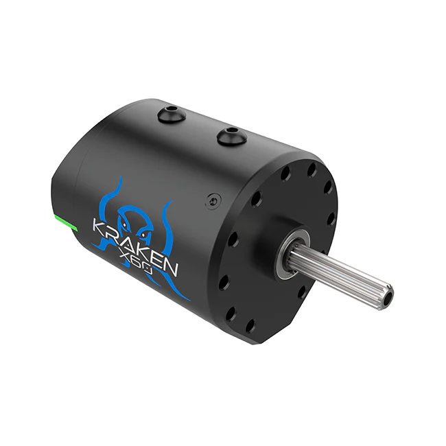
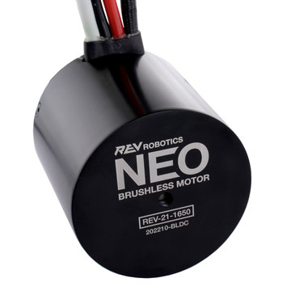
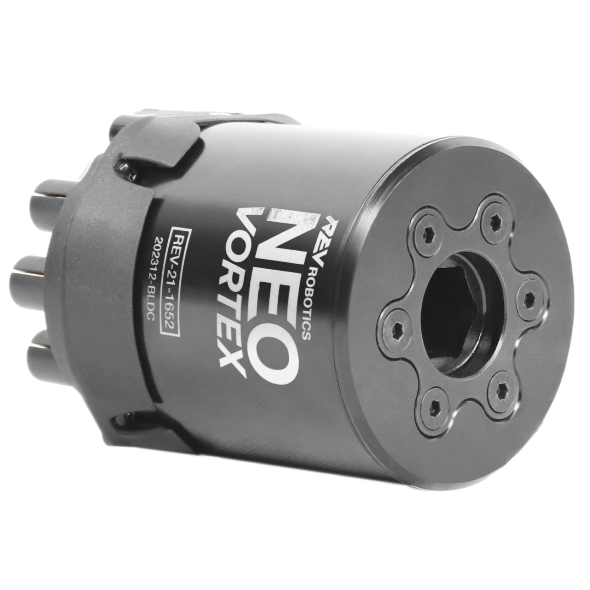
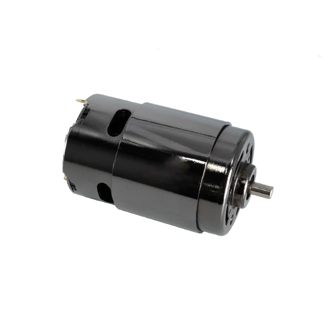
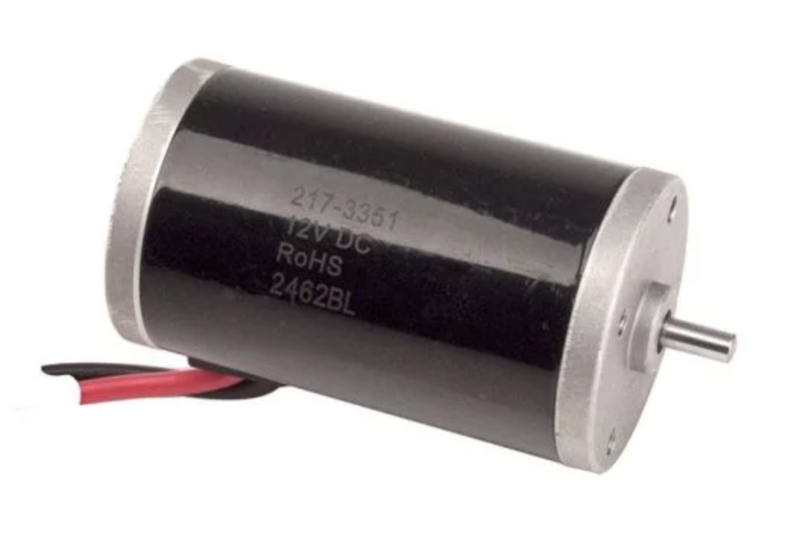

# FRC Legal Motors

## Overview

Each year there is an allowable motor list included in the challenges game manual. Teams must construct their robots using only motors included in the list. In FRC, typically their are brushless, brushed, servo, and linear motors available for team use. The list from the 2024 game manual is shown below.

!!! note
    As of the 2024 game manual, only four motors are permitted to transmit power to the carpet. (Typically through the drivetrain)

## Commonly Used Motors

| Motor | Type | Picture |
| --- | --- | --- |
| [Kraken x60](https://wcproducts.com/collections/motors-pneumatics/products/kraken) | brushless |  |
| [Falcon 500](https://www.vexrobotics.com/217-6515.html) | brushless |  |
| [REV Robotics Neo](https://www.revrobotics.com/rev-21-1650/) | brushless |  |
| [REV Robotics Neo 550](https://www.revrobotics.com/rev-21-1651/) | brushless |  |
| [REV Robotics Neo Vortex](https://www.revrobotics.com/rev-21-1652/) | brushless |  |
| [Andymark Redline Motor](https://www.andymark.com/products/andymark-775a-redline-motor?via=Z2lkOi8vYW5keW1hcmsvV29ya2FyZWE6OkNhdGFsb2c6OkNhdGVnb3J5LzViYjYxOGI0YmM2ZjZkNmRlMWU2OWZkZg) | brushed |  |
| [West Coast Products 775 Pro](https://wcproducts.com/collections/motors-pneumatics/products/brushed-motors) | brushed |  |
| [VEX BAG Motor](https://www.vexrobotics.com/217-3351.html) | brushed |  |

!!! warning
    The Legal Motors list does periodically change with the release of a new seasons manual. Special attention should be given to ensure compliance with the current years game manual.

## 2024 Legal Motors List

- AndyMark 9015
- AndyMark NeveRest
- AndyMark PG
- AndyMark RedLine Motor
- AndyMark Snow Blower Motor
- Banebots 550 and 775
- RS775WC-8514
- RS550
- CIM
- Falcon 500
- Current/former KOP automotive motors
- Nidec Dynamo BLDC Motor
- Playing with Fusion Venom
- REV Robotics HD Hex
- REV Robotics NEO Brushless
- REV Robotics NEO 550
- REV Robotics NEO Vortex
- VEX BAG
- VEX Mini-CIM
- West Coast Products Kraken x60
- West Coast Products RS775 Pro
- Electrical solenoid actuators or electromagnets with rated electrical input power no greater than 50 watts (W) continuous duty at 12 volts (VDC) (if qualifying actuator is then used at 24V, it must be approved by the manufacturer for use at 24V)
- Fans, no greater than 120mm (nominal) size and rated electrical input power no greater than 10 watts (W) continuous duty at 12 volts (VDC)
- Hard drive motors part of a legal COTS computing device
- Factory installed vibration and autofocus motors resident in COTS computing devices (e.g. rumble motor in a smartphone).
- PWM COTS servos with a retail cost < $75.
- Motors integral to a COTS sensor (e.g. LIDAR, scanning sonar, etc.), provided the device is not modified except to facilitate mounting
- 1 compressor compliant with R806 and used to compress air for the ROBOT’S pneumatic system
