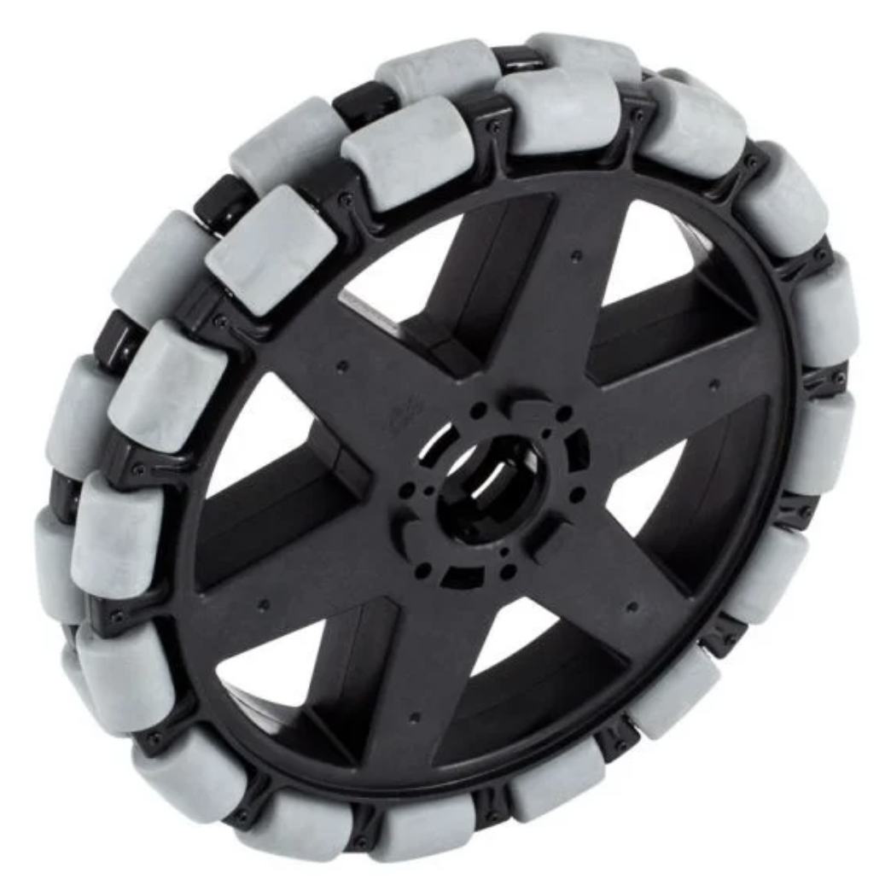

# Wheels

## Mechanism Wheels (Intakes and Conveyance)

## Drivetrain Wheels

### Treaded Traction Wheels

- Blue Nitrile Tread
- Black Neoprene Tread
- Natural Rubber Tread
- 3d Printed TPU Tread

### Team 88 Inspired Studded Wheels (VexPro Grip Lock Wheel Shown)

### Colson Performa Wheel

!!! warning
    Avoid use of omni-wheels or mecanum wheels shown below in drive drain applications due to the lower Coefficient of Friction (COF) with the carpet in the non driving direction of the wheel.

### Omni-Wheel

### Mecanum Wheel

