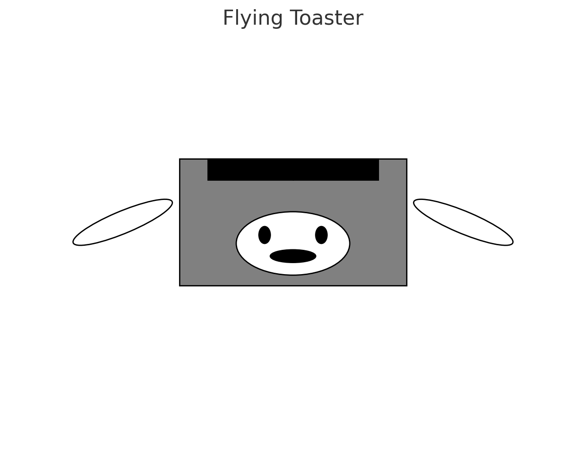

# Examples

This page shows examples of different text formatting options available within the MKDocs framework.

## Hyperlink

[This text gets displayed and takes you to Google when clicked.](https://www.google.com)

## Image



## Admonitions

!!! quote
    This is a quote.

!!! example
    This is an example.

!!! note
    This is a note.

!!! abstract
    This is an abstract.

!!! info
    This is info.

!!! tip
    This is a tip.

!!! success
    This is successful.

!!! question
    This is a question?

!!! warning
    This is a warning!

!!! failure
    This is a failure.

!!! danger
    This is dangerous.

!!! bug
    This is a bug.

## Code Annotation Examples

### Codeblocks

Some `code` goes here.

### Plain codeblock

A plain codeblock:

```
Some code here
def myfunction()
// some comment
```

#### Code for a specific language

Some more code with the `py` at the start:

``` py
import tensorflow as tf
def whatever()
```

#### With a title

``` py title="bubble_sort.py"
def bubble_sort(items):
    for i in range(len(items)):
        for j in range(len(items) - 1 - i):
            if items[j] > items[j + 1]:
                items[j], items[j + 1] = items[j + 1], items[j]
```

#### With line numbers

``` py linenums="1"
def bubble_sort(items):
    for i in range(len(items)):
        for j in range(len(items) - 1 - i):
            if items[j] > items[j + 1]:
                items[j], items[j + 1] = items[j + 1], items[j]
```

#### With highlighted lines

``` py hl_lines="2 3"
def bubble_sort(items):
    for i in range(len(items)):
        for j in range(len(items) - 1 - i):
            if items[j] > items[j + 1]:
                items[j], items[j + 1] = items[j + 1], items[j]
```

#### With title, line numbers, and highlighting

``` py title="bubble_sort.py" linenums="1" hl_lines="2 3"
def bubble_sort(items):
    for i in range(len(items)):
        for j in range(len(items) - 1 - i):
            if items[j] > items[j + 1]:
                items[j], items[j + 1] = items[j + 1], items[j]
```
