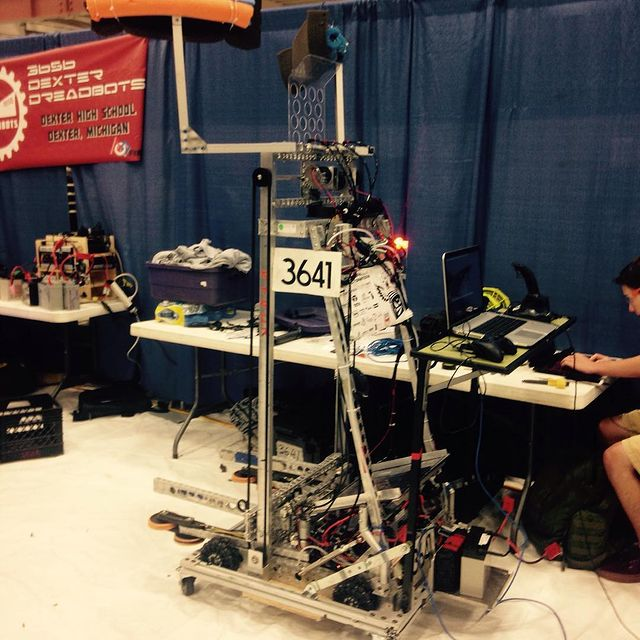

# 2015

## Promo Video

<iframe width="560" height="315" src="https://www.youtube.com/embed/B-EGo1oNcdg?si=3XxsZwaL7lAljzV4" title="YouTube video player" frameborder="0" allow="accelerometer; autoplay; clipboard-write; encrypted-media; gyroscope; picture-in-picture; web-share" referrerpolicy="strict-origin-when-cross-origin" allowfullscreen></iframe>

## Season Overview

### Game

[Recycle Rush](http://youtu.be/W6UYFKNGHJ8)

### Record

- Average qual score: 129.47
- Average playoff score: 154.36
- Official Record: 0-4
- Unofficial Total Record: TBD

!!! note
    Official play in season considered Average match score for rankings and performance until the finals. Unofficial Total Record was computed afterwards from wins, losses, and ties as seen on the blue alliance from each match.

### Events

- Gull Lake District
- Livonia District
- Bedford District
- Michigan State Championship
- World Championship, Newton Division

## Robot Picture

